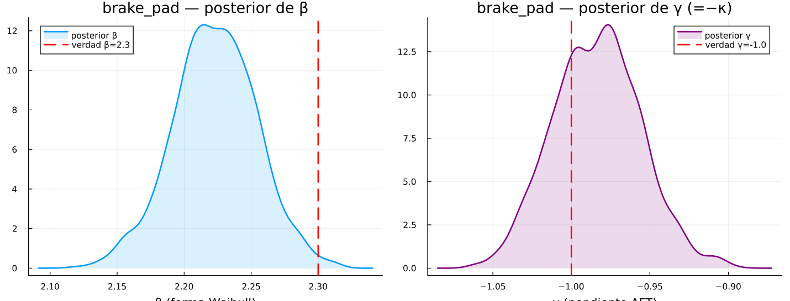
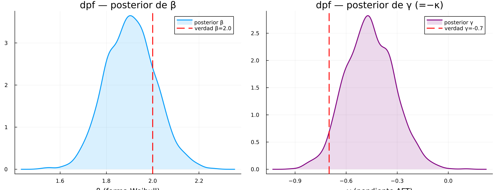
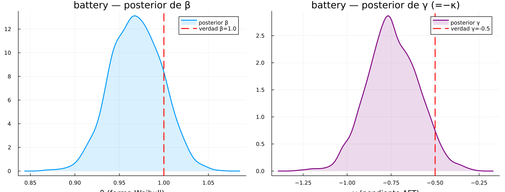
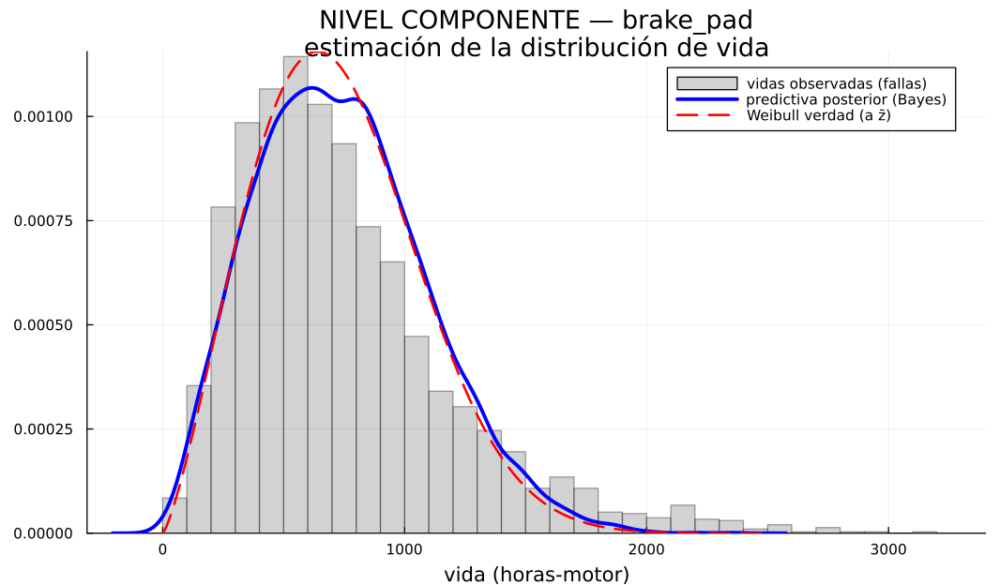
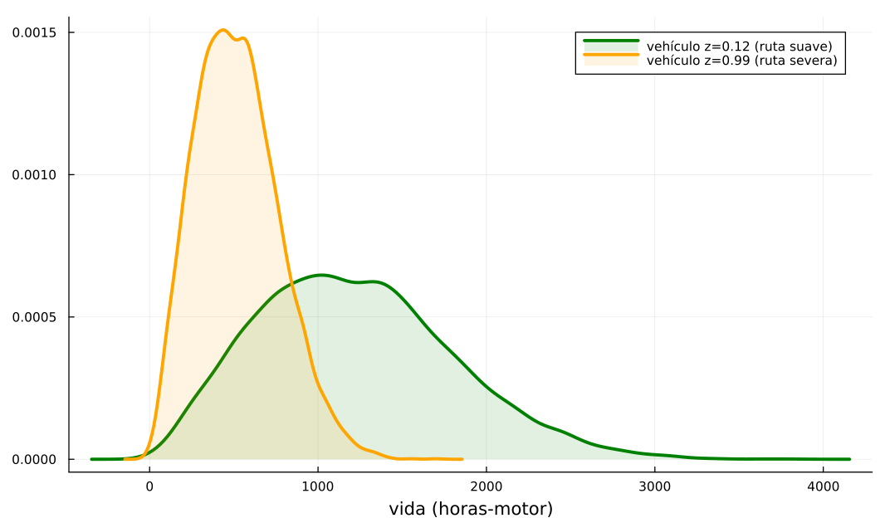
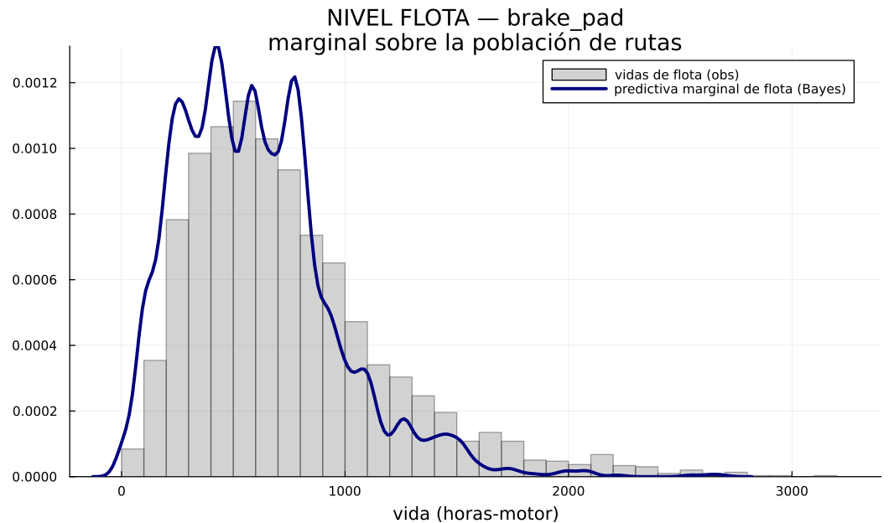
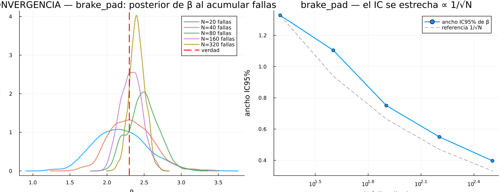
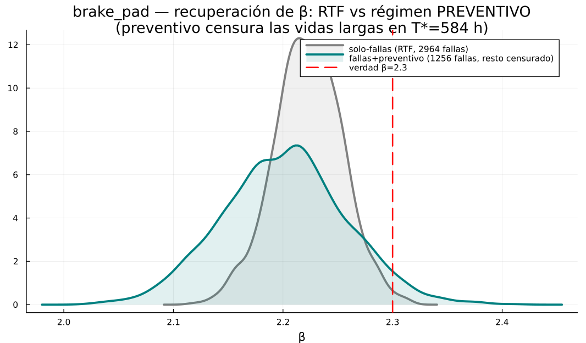
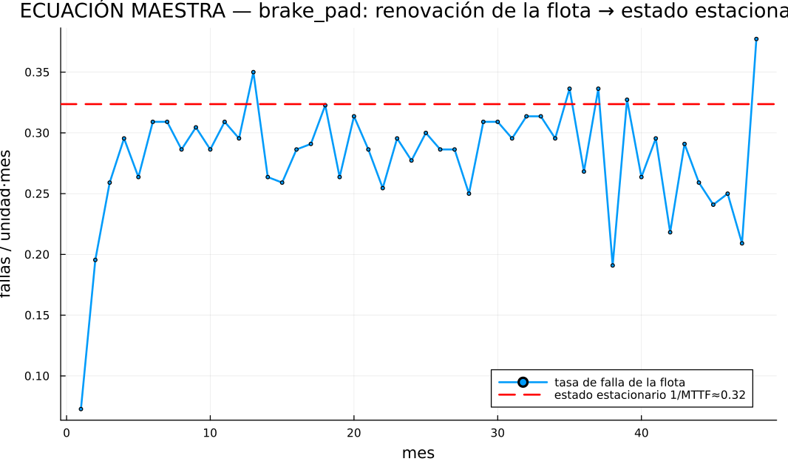
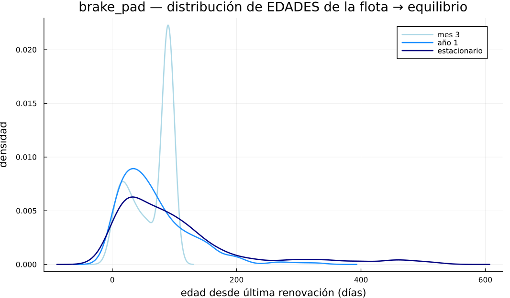

# Reporte bayesiano — estimación de la distribución de vida y convergencia

**Qué muestra:** cómo la engine estima la distribución de vida de cada componente con un modelo
**bayesiano jerárquico** (Turing.jl), validado contra **verdad conocida** (datos sintéticos del
simulador), a tres niveles (**componente / vehículo / flota**), su **convergencia** al acumular datos,
el paso de **solo-fallas → fallas+preventivo**, y la evolución de la **ecuación maestra** de la flota.

Generado por `run_bayes_report.jl` (figuras en `figures/`). El ajuste bayesiano es **offline** (p. ej.
1×/día); su costo en segundos no afecta el servicio en vivo, que solo consume el posterior ya ajustado.

Versión 1.0 — 2026-06-18. Cruza con `Fundamentos_Adenda_Implementacion_Auditoria.md`.

---

## 0. El puente físico → Weibull (de dónde sale la distribución)

La vida **no se postula**: emerge de la física. El daño acumula a tasa dependiente del uso y la
severidad de ruta `z`, y la pieza falla al cruzar un umbral aleatorio:

$$D(t)=\sum_{\text{viajes}} \text{engine\_h}\cdot e^{\kappa z}\cdot \xi,\qquad \text{falla cuando } D\ge \Theta\sim \text{Weibull}(\beta,\eta_{\text{ref}}).$$

Por construcción, la vida en horas-motor es

$$T\sim \text{Weibull}\big(\beta,\ \eta(z)\big),\qquad \eta(z)=\eta_{\text{ref}}\,e^{-\kappa z}.$$

⇒ La **forma** $\beta$ y la **pendiente AFT** $\gamma=-\kappa$ son verdad conocida y **recuperable**. La
heterogeneidad (montaña vs llano) no se postula: viene de `z`. Esto es lo que el estimador debe recobrar.

---

## 1. Verosimilitud Weibull-AFT (la ecuación maestra de la estimación)

Cada observación $i$ es $(t_i,a_i,d_i,z_i)$: vida `exit_age` $t_i$, edad de entrada `entry_age` $a_i$
(**truncamiento izquierdo**), indicador de falla $d_i\in\{0,1\}$ (0 = **censura derecha**), severidad
$z_i$. Con $\eta_i=\eta_0\,e^{\gamma z_i}$, la log-verosimilitud por observación es

$$\ell_i = d_i\Big[\log\beta-\beta\log\eta_i+(\beta-1)\log t_i\Big]-\Big(\tfrac{t_i}{\eta_i}\Big)^{\beta}+\Big(\tfrac{a_i}{\eta_i}\Big)^{\beta}.$$

El término $+(a_i/\eta_i)^\beta$ condiciona en que la pieza sobrevivió hasta $a_i$ (truncamiento). Para
censura ($d_i=0$) solo queda la supervivencia $\log S(t_i)=-(t_i/\eta_i)^\beta$. Esta es la base tanto
del ajuste frecuentista (`Survival.fit_grouped`) como del bayesiano (`BayesEstimator`).

---

## 2. Posterior bayesiano y jerarquía (partial pooling)

Bayes: $p(\theta\mid \text{datos})\propto \mathcal L(\text{datos}\mid\theta)\,p(\theta)$, con
$\theta=(\beta,\eta_0,\gamma,\sigma_v,\{b_v\})$. Priors débilmente informativos:

$$\beta\sim \mathcal N_{[0.2,12]}(2,1),\quad \log\eta_0\sim \mathcal N(\log\bar t,1.5),\quad \gamma\sim\mathcal N(0,1),\quad \sigma_v\sim \mathcal N^+(0,0.15).$$

**Jerarquía (3 niveles):** la escala por vehículo es

$$\eta_{v}=\eta_0\,\exp(\gamma\,z_v+\sigma_v\,b_v),\qquad b_v\sim\mathcal N(0,1).$$

- **Flota** = hiperparámetros compartidos $(\beta,\eta_0,\gamma)$ — todos los vehículos los informan.
- **Vehículo** = $\eta_v$ (su ruta $z_v$ + efecto residual $b_v$).
- **Componente** = la forma $\beta$ y escala $\eta_0$ del componente.

El posterior se obtiene por **MCMC (NUTS/HMC)**. Resultado clave en datos sintéticos: $\sigma_v\to 0$
(IC ≈ [0.00, 0.07]) — la correlación entre vehículos la explica la **ruta** ($z$, vía $\gamma$), **no**
un frailty. Es el mismo hallazgo del proyecto, ahora demostrado bayesianamente.

### Recuperación de parámetros vs verdad

El posterior **cubre la verdad** en componentes de desgaste (brake_pad β≈2.3, dpf β≈2.0) y en battery
el posterior de β se concentra en ~1 (falla casi aleatoria) — por eso la regla IFR rehúsa preventivo.

---

## 3. Estimación de la distribución a 3 niveles

La **predictiva posterior** mezcla la incertidumbre de parámetros + la aleatoriedad intrínseca:

$$p(\tilde t\mid \text{datos},z)=\int \text{Weibull}\big(\tilde t\mid\beta,\eta_0 e^{\gamma z}\big)\,p(\beta,\eta_0,\gamma\mid\text{datos})\,d\theta.$$

| Nivel | Qué es | Figura |
|---|---|---|
| **Componente** | distribución de vida del componente a severidad media $\bar z$ |  |
| **Vehículo** | corrimiento AFT: ruta suave (η grande) vs severa (η chica) |  |
| **Flota** | marginal sobre la población de rutas (mezcla) |  |

La predictiva (azul) se ajusta al histograma observado (gris) y a la Weibull verdadera (rojo punteado).

---

## 4. Convergencia: el posterior se estrecha al acumular datos

Bernstein–von Mises: con $N$ creciente el posterior tiende a normal alrededor de la verdad y su
dispersión cae como $1/\sqrt N$:

$$p(\theta\mid \text{datos})\ \xrightarrow{N\to\infty}\ \mathcal N\!\big(\hat\theta,\ \tfrac1N I(\theta)^{-1}\big),\qquad \text{ancho IC}\propto N^{-1/2}.$$

A la izquierda, el posterior de $\beta$ se concentra sobre la verdad conforme se acumulan fallas; a la
derecha, el ancho del IC95% sigue la referencia $1/\sqrt N$. **Implicación operativa:** con poca historia
el IC de $\beta$ es ancho ⇒ la regla IFR ($\beta_{lo}>1$) **rehúsa** preventivo (conservador y honesto)
hasta tener evidencia suficiente.

---

## 5. Solo-fallas (run-to-failure) → fallas + preventivo

Cuando se introduce el preventivo, las vidas largas se **censuran** en $T^\star$ (se reemplaza antes de
fallar): hay **menos fallas observadas** y más censura. La verosimilitud (§1) usa ambas, así que la
Weibull **sigue siendo recuperable** desde datos censurados — solo que con menos información por unidad.

Gris = mundo run-to-failure (muchas fallas, posterior estrecho); turquesa = régimen preventivo (pocas
fallas, resto censurado en $T^\star$, posterior más ancho pero centrado en la verdad). Es la trayectoria
real de una flota: empieza atendiendo fallas y converge al régimen preventivo sin perder el modelo.

### Decisión: intervalo óptimo y regla IFR
$$C(T)=\frac{c_p\,R(T)+c_f\,[1-R(T)]}{\int_0^T R(u)\,du},\qquad T^\star=\arg\min_T C(T).$$
Preventivo **solo si** $\beta_{lo}>1$ (IC excluye 1, desgaste real) **y** el ahorro $s_{\text{prev}}\ge
s_{\min}$. RUL de forma cerrada para "cuándo intervenir":
$$\mathrm{RUL}(t)=\mathbb E[T-t\mid T>t]=\eta\,e^{w}\,\Gamma\!\big(1+\tfrac1\beta\big)\,Q\!\big(1+\tfrac1\beta,w\big)-t,\quad w=(t/\eta)^\beta.$$

---

## 6. Ecuación maestra: renovación de la flota → estado estacionario

Cada componente es un **proceso de renovación**: falla, se reemplaza, vuelve a envejecer. La **ecuación
de renovación** (forma integral de la ecuación maestra / Chapman–Kolmogorov para el proceso de conteo)
para la función de renovación $m(t)=\mathbb E[N(t)]$ es

$$m(t)=F(t)+\int_0^t m(t-x)\,dF(x).$$

Dos consecuencias asintóticas que la simulación reproduce:

1. **Teorema elemental de renovación:** la tasa de falla de la flota converge a $1/\mu$ con
   $\mu=\mathbb E[T]=\eta\,\Gamma(1+1/\beta)$ (MTTF).
   
2. **Teorema clave de renovación:** la **distribución de edades** de la flota converge al equilibrio
   $$f_A(a)=\frac{S(a)}{\mu}=\frac{1-F(a)}{\mu}.$$
   

La distribución de edades arranca concentrada (flota nueva) y se relaja al equilibrio (~año 1, dominado
por los componentes de vida corta como balatas). Este es el sustrato sobre el que la economía calcula el
break-even y el EUAC: el régimen estacionario es donde el ahorro del preventivo se estabiliza.

### Los tres niveles de la ecuación maestra
- **Componente:** un proceso de renovación con su $(\beta,\eta)$ → su tasa $1/\mu_c$ y equilibrio $S_c(a)/\mu_c$.
- **Vehículo:** superposición de los procesos de sus componentes (cada uno con su $\eta_v$ por ruta).
- **Flota:** superposición sobre todos los vehículos → la tasa agregada y la mezcla de edades de arriba.

---

## 7. Resumen de ecuaciones usadas

| # | Ecuación | Rol | Código |
|---|---|---|---|
| 0 | $T\sim\text{Weibull}(\beta,\eta_{\text{ref}}e^{-\kappa z})$ | puente físico→vida (verdad) | `DamageModels`, `LifeProcess` |
| 1 | $\ell_i$ Weibull-AFT (censura+truncamiento) | verosimilitud | `Survival`, `BayesEstimator` |
| 2 | $p(\theta\mid D)\propto \mathcal L\,p(\theta)$ + jerarquía $\eta_v$ | posterior bayesiano | `BayesEstimator` |
| 3 | predictiva posterior $p(\tilde t\mid D,z)$ | distribución estimada | `predict_lifetimes` |
| 4 | $\text{ancho IC}\propto N^{-1/2}$ (Bernstein–von Mises) | convergencia | — |
| 5 | $C(T)$, $T^\star$, regla IFR ($\beta_{lo}>1$) | decisión preventiva | `Decision` |
| 6 | $\mathrm{RUL}(t)$ forma cerrada | cuándo intervenir | `RUL` |
| 7 | $m(t)=F+\!\int m\,dF$; $1/\mu$; $f_A=S/\mu$ | ecuación maestra / renovación | `LifeProcess`, `Economics` |
